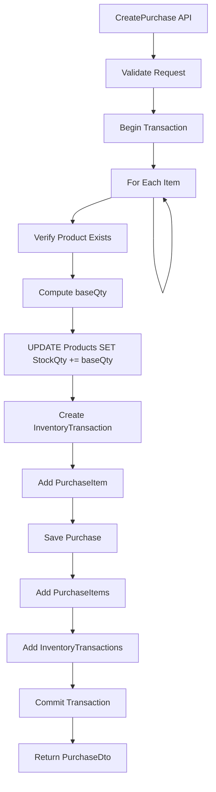
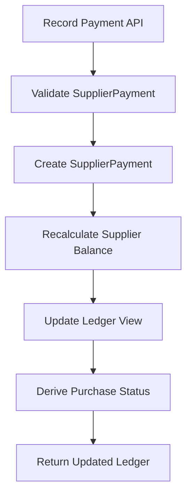
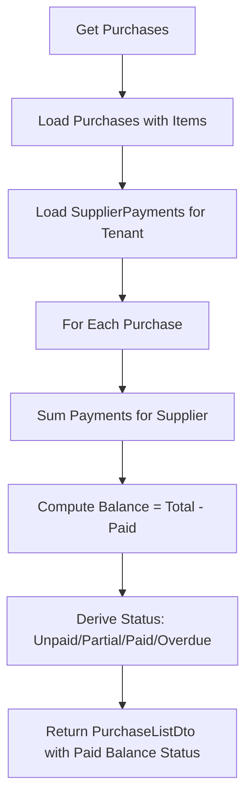

# HexaBill ERP System Redesign Plan

**Generated:** Analysis of Purchase, Supplier, and Inventory modules for distributor ERP workflows.

**Tech Stack:** React 18 + Vite (frontend/hexabill-ui/), ASP.NET Core 9 + EF Core (backend/HexaBill.Api/), PostgreSQL/SQLite.

---

## 1. DIAGNOSIS

### 1.1 What Is Wrong in the Current System

| Issue | Current State | Gap |
|-------|---------------|-----|
| **Inventory stock = 0** | User reports products show 0 stock after purchases | Backend logic exists; root cause needs verification |
| **Purchase Page UX** | Free-text supplier, no payment type, no quick-create | Missing: Supplier Section, Payment Type, Balance preview, structured layout |
| **Supplier Ledger** | No supplier payments; suppliersAPI unused | No SupplierPayment entity; no Suppliers page; ledger incomplete |
| **Supplier Page** | Does not exist in navigation | Layout has Purchases only; no `/suppliers` route |
| **Purchase List** | No Paid, Balance, Status columns | Purchase model has no payment tracking; PurchaseDto lacks these fields |
| **Supplier entity** | Derived from Purchase.SupplierName only | No Supplier table; cannot store Phone, CreditLimit, etc. |

### 1.2 Root Cause Analysis: Inventory Stock = 0

**Code path traced in `PurchaseService.CreatePurchaseAsync` (PurchaseService.cs lines 163–391):**

1. **Stock update executed:** Yes. Lines 293–296 execute `UPDATE Products SET StockQty = StockQty + baseQty`.
2. **baseQty calculation:** `baseQty = item.Qty * conversionToBase` where `conversionToBase = product.ConversionToBase > 0 ? product.ConversionToBase : 1m`. If ConversionToBase is 0, it defaults to 1, so baseQty should be correct.
3. **ProductService maps StockQty:** Yes. `ProductService.GetProductsAsync` (ProductService.cs lines 125–136, 155–166) selects `StockQty = p.StockQty` into ProductDto.
4. **ProductsController:** Returns `ApiResponse<PagedResponse<ProductDto>>` with `Data.Items` containing products. ASP.NET Core serializes to camelCase (`stockQty`).

**Hypotheses for stock = 0:**

| # | Hypothesis | How to Verify |
|---|------------|---------------|
| 1 | **TenantId mismatch** | Product.TenantId != JWT tenantId. UPDATE has `AND "TenantId" = {tenantId}`. If products have null or different TenantId, update affects 0 rows and throws. Check whether exceptions are swallowed or not surfaced. |
| 2 | **Transaction rollback** | If any step after stock update throws, transaction rolls back. Verify no silent catch that commits partial state. |
| 3 | **Frontend caching** | `loadProducts()` runs after save; axios or browser may cache GET /products. Check cache headers. |
| 4 | **Super Admin vs Tenant view** | IsSystemAdmin uses different query; may not apply tenant filter. Ensure logged-in user is tenant, not super admin. |
| 5 | **Product search vs product list** | Purchase form uses `productsAPI.searchProducts` for add-item dropdown; Products page uses `getProducts`. Both should return stockQty. Verify search endpoint maps StockQty. |
| 6 | **Race condition** | `loadProducts()` called immediately after create. Backend may not have committed yet. Add short delay or ensure response waits for commit. |
| 7 | **Reset-all-stock / wipe** | SuperAdminTenantService has "wipe" that sets StockQty = 0. Check if data was reset. |
| 8 | **Database isolation** | Read replica or connection pool returning stale read. Unlikely but possible. |

**Recommended debug steps:** Add logging in `PurchaseService` after stock update to confirm `rowsAffected > 0`; query Products table directly after a test purchase; verify Product.TenantId matches CurrentTenantId.

### 1.3 Gaps in Supplier Accounting

- **No SupplierPayment entity:** Payments to suppliers cannot be recorded.
- **SupplierService.GetSupplierTransactions:** Returns only Purchases (debit) and PurchaseReturns (credit). No credits for payments.
- **SupplierBalanceDto:** Has TotalPurchases, TotalReturns, NetPayable. NetPayable = Purchases - Returns only. Should be Purchases - Returns - Payments.
- **No Purchase.PaidAmount / PaymentStatus:** Cannot derive Paid/Unpaid/Partial/Overdue.
- **suppliersAPI (services/index.js):** Defined but never used. No Suppliers page, no Supplier Ledger UI in routes.

---

## 2. INVENTORY ARCHITECTURE

### 2.1 Correct Flow

```
Purchase saved → PurchaseItems saved → InventoryTransaction created → Product.StockQty updated
```

**File:** `backend/HexaBill.Api/Modules/Purchases/PurchaseService.cs`

Current implementation already follows this. For each item:
1. Create PurchaseItem.
2. Execute `UPDATE Products SET StockQty = StockQty + baseQty`.
3. Create InventoryTransaction (TransactionType.Purchase, ChangeQty = baseQty).

### 2.2 Inventory Rules

| Event | Stock Effect | TransactionType |
|-------|--------------|-----------------|
| Purchase | +stock | Purchase |
| Sale | -stock | Sale |
| Sale Return | +stock | Return |
| Purchase Return | -stock | PurchaseReturn |
| Stock Adjustment | ±stock | Adjustment |
| Damaged/Write-off | -stock | Adjustment (negative ChangeQty) |

### 2.3 Reconciliation

- **Current:** Stock stored in `Product.StockQty`; `InventoryTransaction` records each change.
- **Reconciliation:** `SUM(InventoryTransaction.ChangeQty) WHERE ProductId = X` should equal `Product.StockQty`.
- **Recommendation:** Add periodic reconciliation job or report; alert if mismatch.

### 2.4 Negative Flow (Wrong Entry, Deleted Purchase)

**Purchase delete (PurchaseService.DeletePurchaseAsync):**
- Reverses stock: `StockQty = StockQty - baseQty` for each item.
- Removes InventoryTransactions where RefId = purchase.Id and TransactionType = Purchase.
- Removes PurchaseItems and Purchase.
- Audit log records deletion.

**Edit purchase:** Reverses old quantities, applies new quantities, updates InventoryTransactions.

**Recommendation:** Add "void" or "reverse" reason in audit log; consider soft-delete for compliance.

---

## 3. SUPPLIER MANAGEMENT SYSTEM

### 3.1 Introduce Supplier Entity?

**Recommendation: Yes, introduce Supplier entity.**

| Field | Purpose |
|-------|---------|
| Id | PK |
| TenantId | Multi-tenant isolation |
| Name | Supplier name (unique per tenant) |
| Phone | Contact |
| Email | Optional |
| Address | Optional |
| CreditLimit | Max outstanding |
| PaymentTerms | e.g. "Net 30" |
| IsActive | Soft delete |
| CreatedAt, UpdatedAt | Audit |

**Migration path:** Keep `Purchase.SupplierName` for backward compatibility; add optional `SupplierId` FK. New purchases can link to Supplier; old data stays supplier-name-only until migration.

### 3.2 Supplier Creation Workflow

- **Where:** Suppliers page (/suppliers) with "Add Supplier" button; Purchase form with "Quick create supplier" when typing supplier name.
- **When:** From Suppliers list; or from Purchase form when supplier not found in dropdown.
- **Quick create:** Modal/inline form: Name (required), Phone. Save and auto-select in purchase form.

### 3.3 Supplier Search

- Autocomplete on Purchase form: type supplier name, call `GET /suppliers/search?q=...`, return matches. Allow "Create new" if no match.
- Suppliers page: search bar, filters by outstanding range, overdue only.

---

## 4. PURCHASE WORKFLOW

### 4.1 Purchase Model Extensions

**Option A: Extend Purchase**
- Add: `PaymentType` (Cash, Credit)
- Add: `PaidAmount`, `PaymentStatus` (Unpaid, Partial, Paid), `Balance`
- Simple but couples purchase with payment; allocation is per-purchase.

**Option B: Separate SupplierPayment (Recommended)**
- New entity `SupplierPayment`: Amount, Date, Mode (Cash/Bank/Cheque), Reference, TenantId.
- Optional: `SupplierPaymentAllocation` linking Payment to Purchase(s) for detailed allocation.
- Purchase status derived: Sum(allocations) vs TotalAmount → Unpaid/Partial/Paid.

**Recommendation:** Option B. Allows one payment to cover multiple purchases and better audit trail.

### 4.2 Page Structure (Purchase Entry)

| Section | Contents |
|---------|----------|
| Supplier Section | Supplier select/autocomplete, "Quick create supplier" button |
| Invoice Information | Invoice No, Date, Expense Category |
| Payment Type | Cash / Credit (pay later) dropdown |
| Supplier Balance Info | If credit: "Current due: AED X. After this purchase: AED Y" |
| Product Entry Table | Search (F3), add items, qty, unit cost, subtotal, VAT, total |
| Totals | Subtotal, VAT, Total |
| Actions | Save, Cancel |

**Files:** `frontend/hexabill-ui/src/pages/company/PurchasesPage.jsx`; restructure form layout.

### 4.3 Validation and Error Prevention

- Duplicate invoice: Already validated (supplier + invoice unique).
- Negative qty: Validated in backend.
- Insufficient stock: N/A for purchases (always adds).
- Invalid product: Validated (product must exist, belong to tenant).

---

## 5. SUPPLIER LEDGER ACCOUNTING

### 5.1 Ledger Rules

| Type | Debit | Credit | Effect on Balance |
|------|-------|--------|-------------------|
| Purchase | TotalAmount | 0 | +Balance |
| Purchase Return | 0 | GrandTotal | -Balance |
| Supplier Payment | 0 | Amount | -Balance |

**Balance:** Running sum. Outstanding = Current balance. Overdue = balance where due date passed and unpaid.

### 5.2 SupplierPayment Entity

| Field | Type |
|-------|------|
| Id | int |
| TenantId | int |
| SupplierName (or SupplierId) | string / int |
| Amount | decimal |
| PaymentDate | DateTime |
| Mode | Cash, Bank, Cheque |
| Reference | string |
| Notes | string |
| CreatedBy | int |
| CreatedAt | DateTime |

### 5.3 Supplier Ledger Table

Columns: Date | Type | Reference | Debit | Credit | Balance

Types: Purchase, Return, Payment.

---

## 6. PAYMENT TRACKING SYSTEM

### 6.1 Recording Payment

- User clicks "Record Payment" from Supplier Ledger or Purchase list.
- Modal: Amount, Date, Mode (Cash/Bank/Cheque), Reference.
- Backend: Create SupplierPayment, recalculate ledger.
- Purchase status: Derived from sum of payments vs total. Unpaid (0 paid), Partial (< total), Paid (≥ total), Overdue (past due and not paid).

### 6.2 Payment Allocation

**Simple model (Phase 1):** Payment reduces overall supplier balance. No per-purchase allocation. Purchase status = heuristic (oldest unpaid first) or "balance paid" flag.

**Allocation model (Phase 2):** SupplierPaymentAllocation links Payment to Purchase. User can choose which invoices to pay. Enables "Partial" per purchase.

---

## 7. UI/UX LAYOUT

### 7.1 Purchase Page
- **File:** `PurchasesPage.jsx`
- Sections: Supplier | Invoice Info | Payment Type | Balance | Products | Totals | Actions
- Quick create supplier: Button next to supplier field; opens modal.
- Keyboard: F3 focuses product search.
- Supplier balance: Fetch via `suppliersAPI.getSupplierBalance(supplierName)` when supplier selected; show "Current due: X, After: Y".

### 7.2 Supplier Page (New)
- **Route:** `/suppliers`
- **File:** `SuppliersPage.jsx` (new)
- Columns: Name | Phone | Total Purchases | Total Paid | Outstanding | Overdue | Last Purchase | Invoice Count | Last Payment | Credit Limit | Actions
- Actions: View Ledger, Edit (when Supplier entity exists)

### 7.3 Supplier Detail
- **Route:** `/suppliers/:name` or `/suppliers/:id`
- Tabs: Summary | Ledger | Purchase History | Payment History

### 7.4 Purchase List
- Columns: Invoice | Supplier | Total | Paid | Balance | Status | Items | Actions
- Filters: All | Paid | Partial | Unpaid | Overdue

### 7.5 Supplier Ledger Modal/Page
- Summary cards: Total Purchases | Total Payments | Outstanding | Overdue | Avg Payment Time
- Ledger table: Date | Type | Reference | Debit | Credit | Balance
- Date range filter; Export (Excel/PDF); "Record Payment" button
- Invoice links: Reference column links to purchase detail

---

## 8. MOBILE & DESKTOP

### 8.1 Mobile
- Collapsible sidebar (hamburger).
- Tables → cards for Suppliers, Purchase list.
- Expandable purchase rows: tap row to expand items.
- Sticky actions (Save, Cancel) at bottom.
- Supplier Ledger: Full-screen or bottom sheet; swipe to close.

### 8.2 Desktop
- Full-width layout; sidebar always visible (or collapsible).
- Clear section borders; no horizontal scroll on forms.
- Purchase form: 2–3 columns for fields; full-width table for items.

---

## 9. ERROR PREVENTION & NEGATIVE FLOW

| Scenario | Handling |
|----------|----------|
| Duplicate invoice | Already validated; throw with clear message |
| Negative qty | Backend validation |
| Insufficient stock (sales) | SaleService validates before deducting |
| Deleted purchase | Reverse stock, remove InventoryTransactions, audit log |
| Negative stock | Prevent: SaleService checks before deduct; alert if Product.StockQty < 0 |
| Wrong payment entry | Allow edit/void of SupplierPayment with audit |
| Deleted SupplierPayment | Reverse ledger entry; audit |

---

## 10. DATABASE ENTITY STRUCTURE

### 10.1 Proposed Entities

**Supplier (new)**
- Id, TenantId, Name, Phone, Email, Address, CreditLimit, PaymentTerms, IsActive, CreatedAt, UpdatedAt

**SupplierPayment (new)**
- Id, TenantId, SupplierId or SupplierName, Amount, PaymentDate, Mode, Reference, Notes, CreatedBy, CreatedAt

**SupplierPaymentAllocation (optional, Phase 2)**
- Id, SupplierPaymentId, PurchaseId, Amount

### 10.2 Purchase Extensions (optional)
- SupplierId (nullable FK to Supplier)
- PaymentType (Cash/Credit) for display; PaidAmount derived from allocations

### 10.3 Relationships
- Supplier 1─* Purchase (SupplierId nullable)
- Supplier 1─* SupplierPayment
- SupplierPayment *─* Purchase (via SupplierPaymentAllocation, Phase 2)

---

## 11. DATA FLOW DIAGRAMS

### 11.1 Purchase Save → Stock Update



### 11.2 Payment Record → Ledger Update



### 11.3 Purchase List → Status Derivation



---

## 12. PRIORITIZED ACTION LIST

| # | Action | Files / Scope |
|---|--------|----------------|
| 1 | **Fix inventory stock=0** | Add logging; verify TenantId; test purchase→product refresh. `PurchaseService.cs`, `ProductsController.cs`, `PurchasesPage.jsx` |
| 2 | **Add Supplier entity + migration** | `Models/Supplier.cs`, `Data/AppDbContext.cs`, new migration |
| 3 | **Add SupplierPayment entity + migration** | `Models/SupplierPayment.cs`, `AppDbContext.cs`, migration |
| 4 | **Extend SupplierService** | Include SupplierPayments in balance and transactions. `SupplierService.cs` |
| 5 | **Add Record Payment API** | `POST /suppliers/{name}/payments` or `POST /supplier-payments` |
| 6 | **Create Suppliers page** | `SuppliersPage.jsx`, route `/suppliers`, Layout nav |
| 7 | **Supplier Ledger UI** | Modal or page with summary cards, ledger table, filters, export, Record Payment button |
| 8 | **Purchase page UX** | Restructure sections; add payment type; supplier balance; quick create supplier |
| 9 | **Purchase list** | Add Paid, Balance, Status columns; add filters (Paid/Unpaid/etc.) |
| 10 | **Mobile responsiveness** | Cards on mobile; collapsible sections; touch-friendly actions |

---

*End of HexaBill ERP Redesign Plan*
